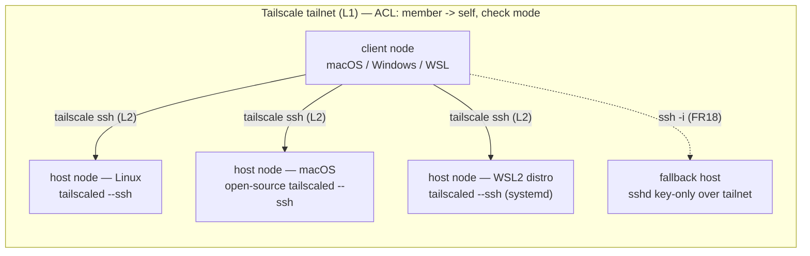
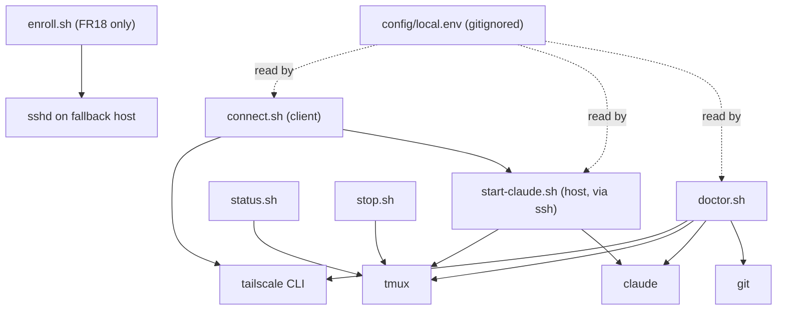
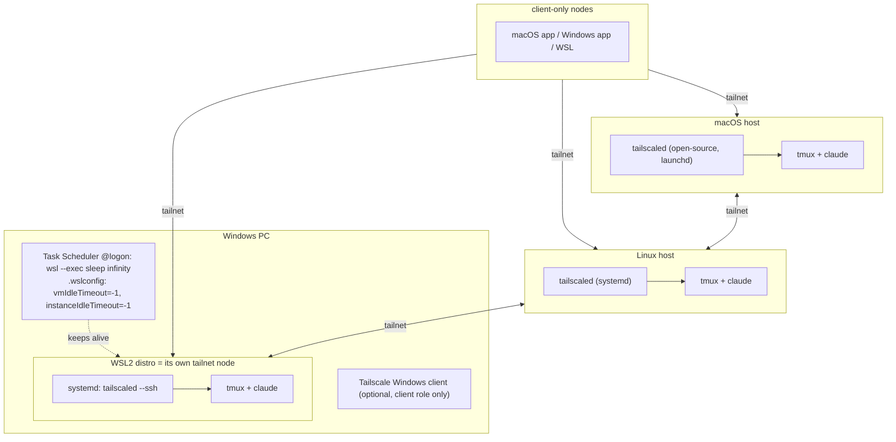

# Architecture Spine — agentic-workstation

## Design Paradigm

**Symmetric peer mesh over a layered transport.** Every machine is a *node* running the same repo; its role (`host`, `client`, `both`) is local, untracked state. There is no hub, registry, or control plane — the tailnet *is* the directory. A connection is a strict stack of four independent layers, each of which keeps working if the layer above it dies:

| Layer | Owner | Lives in |
| --- | --- | --- |
| L1 Network + identity | Tailscale tailnet (MagicDNS, ACL) | outside the repo (tailnet admin console) |
| L2 Transport + auth | Tailscale SSH (primary) / OpenSSH-over-tailnet (fallback) | `scripts/connect.sh`, `scripts/enroll.sh` |
| L3 Persistence | tmux server per host, one session per workspace | `scripts/start-claude.sh`, `status.sh`, `stop.sh` |
| L4 Agent | Claude Code interactive session in a workspace | inside the tmux session |

Repo layout mirrors the layers: `scripts/` (one file per verb, no shared library), `config/` (committed `*.example` only), `docs/` (per node type), `ci/` + `.github/` (hygiene gates).

## Invariants & Rules

### AD-1 — Symmetric node model; role is local state [ADOPTED]

- **Binds:** FR17, NFR6, G5, all scripts
- **Prevents:** a hub/registry, and any script that behaves differently depending on which machine it was written on
- **Rule:** every node clones the same repo to `$HOME/agentic-workstation`; `config/local.env` (gitignored) declares `NODE_ROLE=host|client|both`. Scripts read the role from that file and nothing else, and the role gates the verbs: client verbs (`connect.sh`) require `client|both`, host verbs (`start-claude.sh`, `status.sh`, `stop.sh`, `enroll.sh`) require `host|both`; any other combination exits 2 with one line on stderr. No committed file may name a node, list nodes, or branch on a machine identity. Onboarding node N+1 changes zero files on nodes 1..N.

### AD-2 — Tailnet-only, identity-addressed connectivity [ADOPTED]

- **Binds:** FR3, FR13, NFR1, `connect.sh`, `doctor.sh`, all docs
- **Prevents:** public ports, port-forwards, hard-coded IPs, committed host lists
- **Rule:** peers are addressed only by MagicDNS node name (`<node>`); tailnet IPs (`100.x`, `fd7a:`) never appear in scripts or docs. Discovery is `tailscale status` at run time. Nothing in the repo listens on or forwards a non-tailnet interface.

### AD-3 — Tailscale SSH is the primary transport; OpenSSH is a per-host exception [ADOPTED]

- **Binds:** FR1, FR2, FR18, FR15, NFR6
- **Prevents:** a key mesh (N×(N−1) `authorized_keys` edits), two first-class auth systems, password auth
- **Rule:** hosts advertise with `tailscale up --ssh`; auth is tailnet identity under the tailnet's default `check`-mode rule (`autogroup:member → autogroup:self`). The repo commits **no** ACL policy file and no auth keys. `FALLBACK_SSHD=1` in `config/local.env` opts one host into OpenSSH-over-tailnet: key-only (ed25519, one key per client machine), `PasswordAuthentication no`, `PermitRootLogin no`, `KbdInteractiveAuthentication no`, `AllowUsers <user>`; reachability is limited by the tailnet (no public bind), not by pinning `ListenAddress` to a tailnet IP. `enroll.sh` exists only for this path. The client selects the fallback explicitly — `connect.sh --fallback <node> <workspace>` — using its own untracked `~/.ssh/config` entry for `<node>`; `connect.sh` never probes or keeps a list of fallback hosts.



### AD-4 — Persistence is tmux; Claude Code resume is recovery only [ADOPTED]

- **Binds:** FR6, FR7, FR8, NFR2, `start-claude.sh`, `connect.sh`, `status.sh`, `stop.sh`
- **Prevents:** relying on Claude Code `--bg`/supervisor (research preview) or on `--resume` for live continuity; mosh as a required layer
- **Rule:** a workspace session is exactly one tmux session named `claude-<workspace>` on the host's own tmux server, created with `tmux new -A -s claude-<workspace>` (attach-or-create, so reconnect is idempotent). Claude Code is launched inside it as `claude -n claude-<workspace>` (same name, so a lost tmux server — host reboot — is recovered with `claude --resume claude-<workspace>`). A dropped connection must never terminate the tmux session; only `stop.sh` does, and only for the one session named on its command line (no wildcard, no kill-server).

### AD-5 — Node platform contract [ADOPTED]

- **Binds:** FR14, NFR3, M3, `docs/`, `doctor.sh`
- **Prevents:** a Windows-native "host", a Mac host on the GUI Tailscale app, a WSL host that dies on reboot
- **Rule:** supported hosts are exactly: Linux (`tailscaled` service), macOS (open-source `tailscaled` via Homebrew formula + `brew services`, which replaces the Standalone/App Store app on that machine), and Windows via a WSL2 distro that is its own tailnet node (`/etc/wsl.conf` `[boot] systemd=true`, `tailscaled` under systemd, default NAT networking). A WSL host additionally requires, on the Windows side and outside the repo: `.wslconfig` `[wsl2] vmIdleTimeout=-1` + `instanceIdleTimeout=-1`, an at-logon Task Scheduler entry `wsl.exe -d <distro> --exec sleep infinity`, and no-sleep power settings. One tailnet node per WSL host (one distro). Clients may be any platform. `doctor.sh` encodes this contract as checks.

### AD-6 — Claude Code runs unprivileged, in normal permission mode, inside its workspace [ADOPTED]

- **Binds:** FR5, FR16, NFR1
- **Prevents:** `--dangerously-skip-permissions`, `bypassPermissions`, running as root, cross-workspace access
- **Rule:** `start-claude.sh` launches `claude` with the working directory set to the workspace and `--permission-mode default`; it never passes `--dangerously-skip-permissions` or `--add-dir`. Approvals happen in the attached terminal. Sessions run as the login user of the host, never root (`connect.sh` refuses `SSH_USER=root`).

### AD-7 — Public-repo hygiene is enforced, not promised [ADOPTED]

- **Binds:** FR11, FR12, FR13, NFR4, M2, CI
- **Prevents:** a committed secret, key, node name, or machine inventory
- **Rule:** `.gitignore` excludes `config/local.env`, `*.key`, `*.pem`, `authorized_keys`, `docs/discovery/`, session metadata, logs. `gitleaks` runs as a pre-commit hook (`gitleaks git --pre-commit --staged`) and as a GitHub Action on every push/PR; CI is red on any finding. Docs use `<node>`, `<user>`, `<workspace>`, `<distro>` placeholders only. Scripts never echo tokens, keys, or peer names into logs. Claude Code transcripts stay in `~/.claude/` on the host — never inside a workspace or this repo.

### AD-8 — Scripts are portable bash, one verb per file, self-checking

- **Binds:** FR9, FR10, NFR3, `scripts/*`
- **Prevents:** a shared shell library, bash-4-only syntax that breaks on macOS, `jq`/Python runtime dependencies, an untested script
- **Rule:** every script is `#!/usr/bin/env bash` + `set -euo pipefail`, compatible with bash 3.2 (no associative arrays, no `${var,,}`), passes `shellcheck` in CI, parses `tailscale status` text output (no `jq`), and exposes `--check` (self-test with no side effects) which `doctor.sh` aggregates. Runtime dependencies are exactly: `tailscale`, `tmux`, `claude`, `git`, plus `ssh`/`sshd` on FR18 hosts.



Dependency direction: scripts → CLIs; scripts never depend on each other except `connect.sh` invoking `$HOME/agentic-workstation/scripts/start-claude.sh` on the host by absolute path (a non-interactive `tailscale ssh` shell does not source the login profile); `config/local.env` is read, never written, by scripts.

## Consistency Conventions

| Concern | Convention |
| --- | --- |
| Naming | tmux session and Claude session: `claude-<workspace>`; `<workspace>` = basename of the workspace directory, lowercase, `[a-z0-9-]`, resolved on the host as `$WORKSPACES_DIR/<workspace>` (must already exist; scripts never create it). Repo path on every node: `$HOME/agentic-workstation`. Scripts: `scripts/<verb>[-<object>].sh`. Node names: MagicDNS only, placeholder `<node>` in docs. |
| Data & formats | `config/local.env` is `KEY=value` shell syntax sourced by scripts: `NODE_ROLE`, `WORKSPACES_DIR` (default `$HOME/workspaces`), `FALLBACK_SSHD` (`0`/`1`), `SSH_USER`. Committed twin: `config/local.env.example`. Session metadata (FR8) = tmux itself (`tmux ls`), no extra state file. |
| State & cross-cutting | Errors: non-zero exit + one-line message on stderr, never a stack of output. Logging: stdout only, no files, no peer names or secrets. Config: env file → environment → flags, later wins. Auth: tailnet identity; keys only on FR18 hosts, under `~/.ssh` with 0700/0600 (verified by `doctor.sh`). Time: not used. |

## Stack

| Name | Version |
| --- | --- |
| Tailscale (`tailscale` + `tailscaled`; macOS via Homebrew formula) | 1.102.3 |
| tmux | 3.7c |
| Claude Code (native installer, auto-updating) | ≥ 2.1.257 |
| bash (script target; macOS default) | 3.2 (must also run on 5.x) |
| OpenSSH (FR18 fallback hosts only) | platform default (macOS Remote Login / Ubuntu `openssh-server`) |
| gitleaks (pre-commit + `gitleaks/gitleaks-action`) | 8.30.1 |
| shellcheck (CI) | 0.11.0 |
| WSL (Windows hosts) | ≥ 2.4.4 (`instanceIdleTimeout` support — [ASSUMPTION] community-sourced, verify on the host with `wsl --version`) |
| git | 2.x (platform default) |

## Structural Seed

### Connection flow

```mermaid
sequenceDiagram
  participant U as user @ client node
  participant TS as tailnet (MagicDNS + ACL)
  participant H as host node (tailscaled --ssh)
  participant T as tmux server on host
  participant CC as Claude Code
  U->>TS: connect.sh <node> <workspace>
  TS-->>U: identity check (check mode, re-auth if expired)
  U->>H: tailscale ssh -t <user>@<node> -- ~/agentic-workstation/scripts/start-claude.sh <workspace>
  H->>T: tmux new -A -s claude-<workspace>
  alt session exists
    T-->>U: attach (scrollback intact)
  else new
    T->>CC: cd <workspace> && claude -n claude-<workspace> --permission-mode default
  end
  Note over U,T: link drops → tmux keeps CC running; rerun connect.sh to reattach
```

### Deployment / operational envelope



Environments: there is one — the owner's tailnet. No staging; CI (GitHub Actions) runs only shellcheck + gitleaks, never a tailnet.

### Source tree

```text
agentic-workstation/
  scripts/
    connect.sh          # client: <node> <workspace> -> tailscale ssh + start-claude.sh
    start-claude.sh     # host: tmux new -A -s claude-<ws> 'cd <ws> && claude -n ...'
    status.sh           # host: list claude-* tmux sessions
    stop.sh             # host: tmux kill-session claude-<ws>
    doctor.sh           # any: prerequisites per role + aggregates */--check
    enroll.sh           # FR18 only: install a client's ed25519 pubkey on this host
  config/
    local.env.example   # NODE_ROLE, WORKSPACES_DIR, FALLBACK_SSHD, SSH_USER
    ssh_config.example  # client-side: Host <node> + ServerAliveInterval 15 / CountMax 3
    tmux.conf.example   # history-limit, mouse
  docs/
    node-linux.md  node-macos.md  node-wsl.md  node-client.md  fallback-openssh.md
  .github/workflows/hygiene.yml   # shellcheck + gitleaks-action
  .gitleaks.toml                  # allowlist for <placeholder> tokens
  .pre-commit-config.yaml         # gitleaks pre-commit
  .gitignore                      # config/local.env, keys, docs/discovery/, logs
```

## Capability → Architecture Map

| Capability / Area | Lives in | Governed by |
| --- | --- | --- |
| F1 SSH access (FR1, FR2, FR3, FR15, FR17, FR18) | tailnet + `connect.sh`, `enroll.sh`, `docs/node-*.md` | AD-1, AD-2, AD-3 |
| F2 Run Claude Code remotely (FR4, FR5, FR16) | `connect.sh` → `start-claude.sh` | AD-4, AD-6 |
| F3 Persistent sessions (FR6, FR7, FR8) | tmux server per host, `status.sh` | AD-4, Naming convention |
| F4 Operability (FR9, FR10) | `scripts/*`, `doctor.sh` | AD-5, AD-8 |
| F5 Public-repo hygiene (FR11–FR14) | `.gitignore`, `.gitleaks.toml`, `.github/workflows/hygiene.yml`, `docs/` | AD-7, AD-2 |
| NFR2 reconnect < 1 min | tmux attach-or-create + `ssh_config.example` keepalives | AD-4 |
| NFR6 add-only scaling | `config/local.env` + tailnet default ACL | AD-1, AD-3 |

## Deferred

- **mosh** (OQ4) — not adopted; tmux reattach satisfies NFR2. Revisit only if measured reconnects exceed one minute on real links.
- **Claude Code background sessions / `--bg` supervisor** — research preview; tmux is the contract. Re-evaluate when it leaves preview and survives host reboots.
- **Survives host reboot** (auto-start of tmux + Claude on boot, launchd/systemd units) — poc-plan Phase 6; MVP promises "survives disconnect" only.
- **`tailscale serve --tcp 2222 22` shim** for the `tailscaled`-restart gap — document as a manual recovery step, not scripted.
- **Multi-user / tags / tailnet policy file in repo** — single owner; the default ACL suffices. A policy file appears only with the Phase 9 portal.
- **Workspace isolation beyond cwd** (sandboxing, separate OS users per workspace) — poc-plan Phase 7.
- **Session metadata file** (FR8's id/name/workspace/startedAt) — tmux already holds it; add a file only when a consumer other than `status.sh` exists.
- **Phone / Remote Control, Codex, portal, Oracle** — roadmap, out of this spine's altitude.
